# Laporan Proyek Machine Learning - Daffa Muhamad Azhar

# Home Credit Default Risk

PT Home Credit Indonesia merupakan perusahaan pembiayaan yang memberikan layanan pembiayaan bagi pelanggan yang berbelanja secara online maupun offline. Perusahaan ini juga membangun layanan pembiayaan berbasis teknologi. Didirikan pada tahun 2013 di Jakarta, saat ini Home Credit telah menjangkau lebih dari 19.000 titik distribusi yang tersebar di 144 kota di Indonesia.

## Business Understanding

Banyak pelanggan yang kesulitan untuk mendapatkan pinjaman karena credit history yang tidak memadai ataupun tidak ada. Sayangnya, hal ini disalahgunakan oleh peminjam yang tidak dapat dipercaya.

Home Credit berupaya untuk melakukan peminjaman juga untuk masyarakat yang belum pernah menggunakan layanan perbankan dengan memberikan pengalaman peminjaman yang positif dan aman.

Permasalahan yang muncul saat ini adalah bagaimana cara untuk memberikan pengalaman positif dan aman untuk peminjam dengan memastikan bahwa peminjam dapat membayar pinjamannya tersebut tanpa adanya kendala sehingga tidak ada pihak yang dirugikan.

Solusi yang dapat diberikan ialah dengan memanfaatkan data - data yang dimiliki oleh Home Credit untuk memprediksi kemampuan pelanggan untuk membayar pinjamannya sehingga pihak Home Credit juga tidak mengalami kerugian karena adanya pelanggan yang tidak membayar tagihannya.

### Solution Statements

Dalam melakukan prediksi, dapat menggunakan beberapa jenis model. Model - model tersebut juga dapat dilakukan hyperparameter tuning dengan GridSearch untuk mendapatkan parameter terbaik untuk setiap model. Metric yang digunakan untuk setiap model adalah ROC AUC dan recall.

## Data Understanding

Dataset dapat diunduh pada tautan : [Home Credit Default Risk](https://www.kaggle.com/competitions/home-credit-default-risk/data)

Pada dataset tersebut tidak gunakan seluruhnya. Dataset yang digunakan antara lain : 

- application_{train|test}.csv
 - merupakan tabel utama, terpisah menjadi file Train (terdapat TARGET) dan Test (tidak terdapat TARGET).
 - Static data untuk semua pemohon. Satu baris merepresentasikan satu peminjaman.

- bureau.csv
 - Seluruh credit yang pernah dilakukan klien pada institusi finansial lain yang dilaporkan ke biro kredit.
 - Untuk setiap peminjaman terdapat banyak baris tergantung jumlah kredit sebelumnya sebelum waktu peminjaman.

- previous_application.csv
 - seluruh permohonan yang pernah dilakukan sebelumnya pada Home Credit.
 - Terdapat satu baris untuk setiap permohonan sebelumnya terkait peminjaman saat ini.

- POS_CASH_balance.csv
 - saldo bulanan dari POS (point of sales) sebelumnya dan cash loan yang pemohon miliki pada Home Credit.
 - Memiliki satu baris untuk setiap bulan dari credit yang pernah dilakukan pada Home Credit.

### Application Train

Pada Data Application Train, terdapat binary target dengan nama kolom `TARGET`. 

`TARGET` sendiri menjadi tujuan utama dalam melakukan klasifikasi. Model akan memprediksi apakah pemohon memilii `TARGET 1` atau `TARGET 0`. Jika nilai `TARGET` dari pemohon adalah `0`, maka kemungkinan besar tidak akan terjadi masalah dalam pembayaran yang akan datang. Sebaliknya jika `TARGET` dari pemohon adalah `1`, maka besar kemungkinan bahwa pemohon akan mengalami masalah dalam pembayarannya yang akan datang.

Berdasarkan data, perbandingan `TARGET` dalam Application Train seperti pada Chart dibawah.

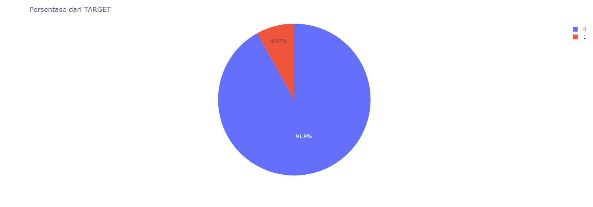

Setelah melihat lebih dalam lagi, 

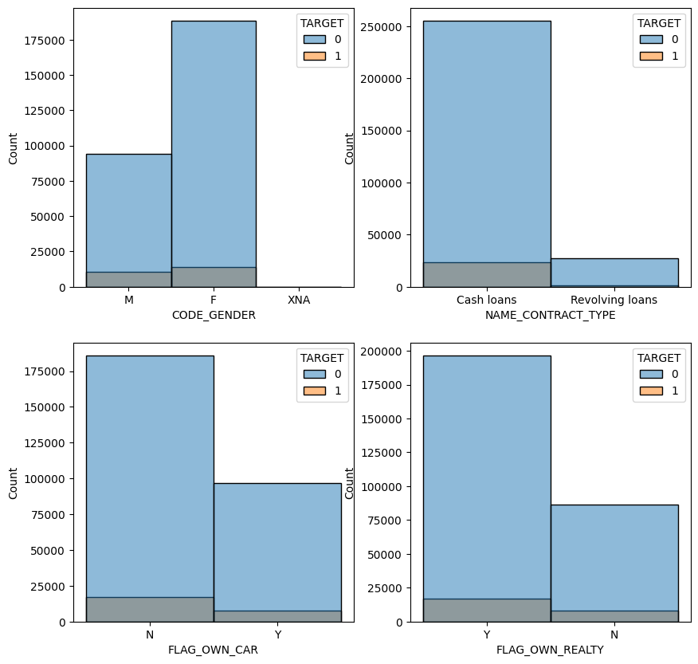

Pemohon dengan jenis kelamin Perempuan lebih banyak dari pada pemohon dengan jenis kelamin Laki - Laki. Dapat dilihat pula bahwa tujuan cash loan / pinjaman tunai menjadi prioritas utama pemohon.

Lebih banyak pemohon yang tidak memiliki mobil dibandingkan dengan yang memiliki mobil. Tetapi pemohon yang memiliki properti lebih banyak dibandingkan dengan pemohon yang tidak memiliki properti.

Kita juga mendapatkan beberapa insight tambahan

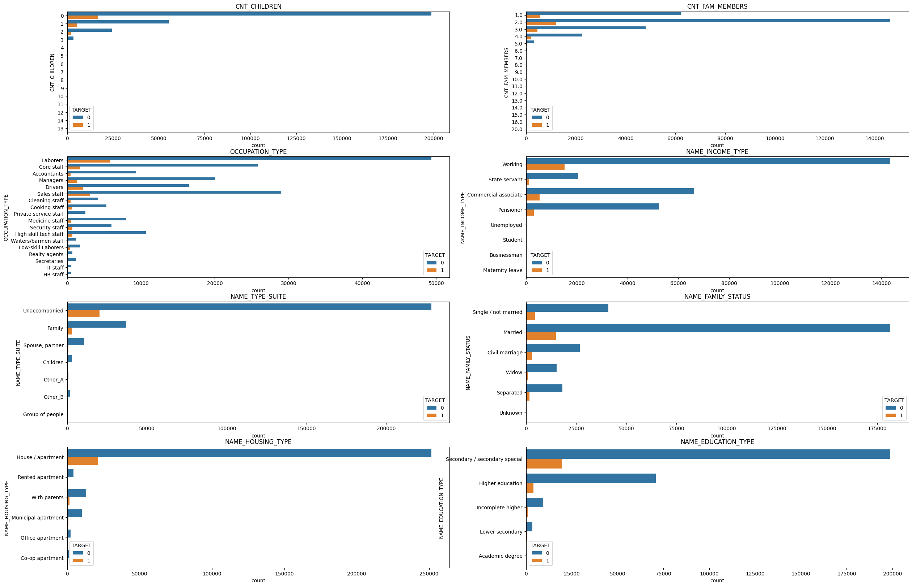

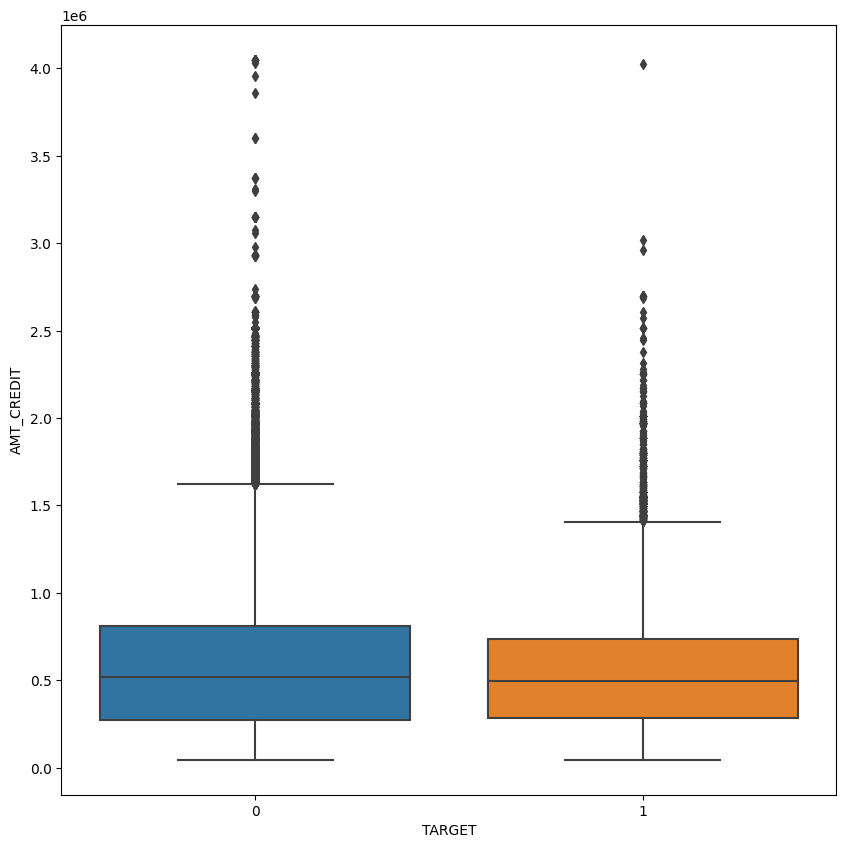

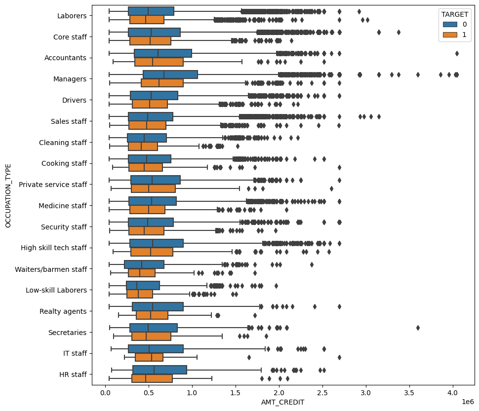

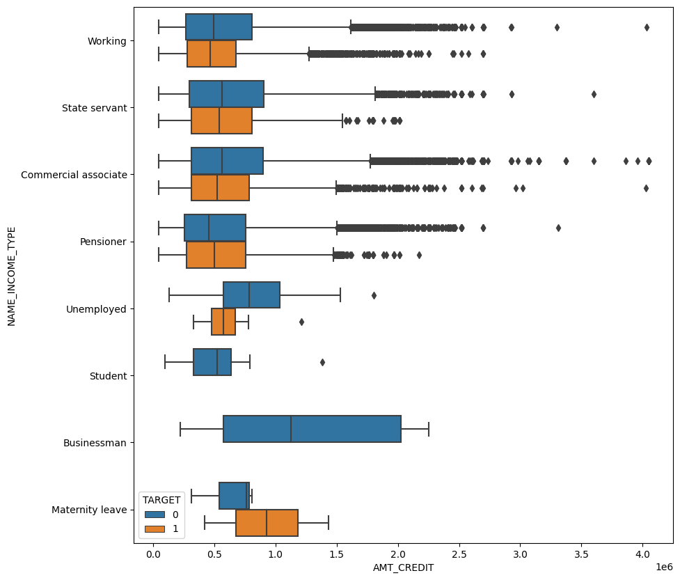

Terlihat juga persebaran umur pemohon dimana rentang umur 30 - 40 merupakan umur yang paling banyak dalam melakukan peminjaman.

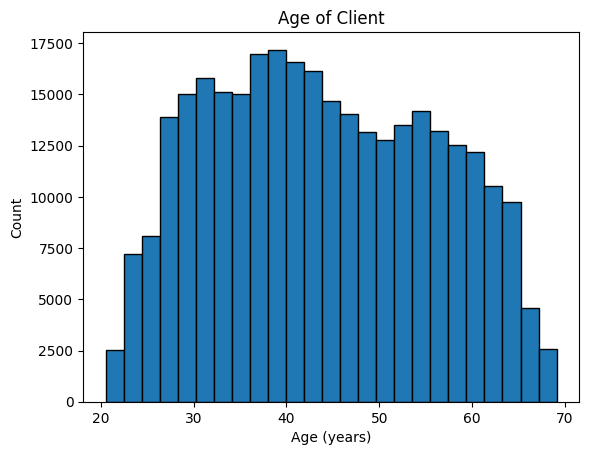

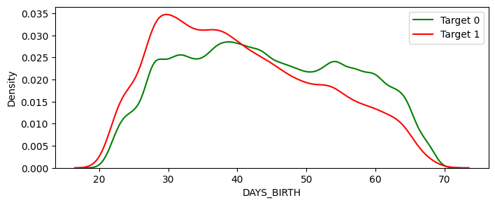

Berikut merupakan persebaran data terhadap lama kerja pemohon

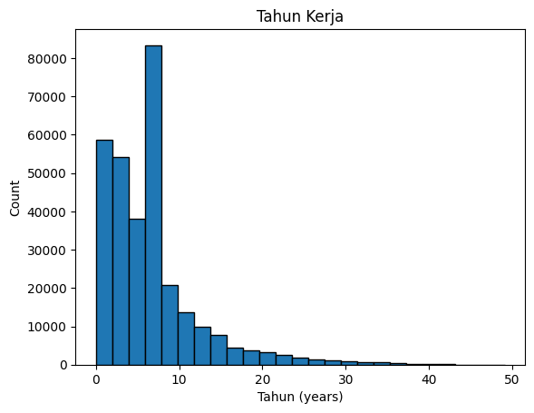

### Bureau

Beberapa insight yang didapat pada data bureau

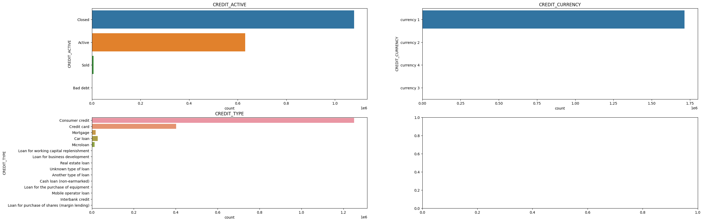

Banyak dari pemohon yang kreditnya sudah lunas dan juga cukup banyak pemohon dengan kredit yang masih aktif dengan tipe kredit yang paling banyak yaitu comsumer credit yaitu sebagai member dari Home Credit.

### Previous Application

Beberapa insight yang didapat

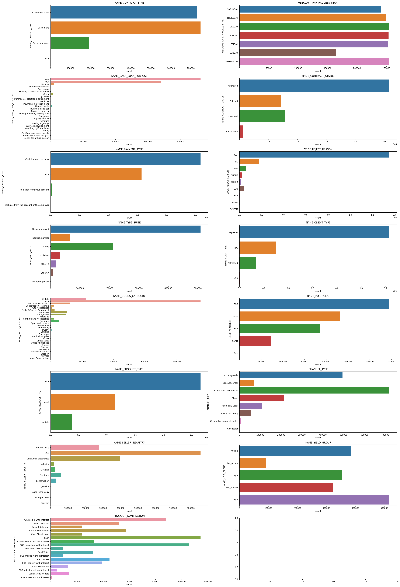

### POS Cash Balance

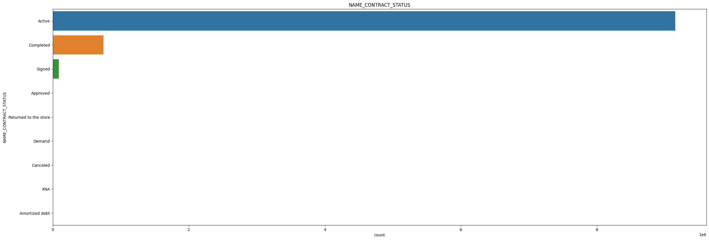

## Data Preparation

Pada data preparation, keempat data tersebut akan digabungkan menjadi satu.

Sebelum itu, harus dilakukan pengecekan baik missing value, outlier, maupun anomali.

Pada data application train, terdapat beberapa anomali seperti lamanya bekerja mencapai 1000 tahun. Hal ini diatasi dengan merubah nilai tersebut menjadi rata - rata dari lama berkerja.

Selain melakukan drop, pembersihan data juga dilakukan dengan melakukan imputing baik dengan mean maupun modus.

Setelah melakukan pembersihan data, maka dilakukan Feature Engineering untuk menambahkan fitur yang diduga dapat meningkatkan performa dari model.

Feature Engineering ini dilakukan pada application train dengan menambahkan fitur baik dari hasil proses data pada tabel tersebut maupun hasil proses dari data tabel yang lain.

Hasil dari Data Preparation ini adalah sebuah dataset baru dengan 179.793 data dan 200 buah fitur.

## Modeling

Sebelum melakukan pelatihan model, Dataset akan displit sebesar 70% untuk data latih dan 30% untuk data test. Saat melakukan splitting, digunakan Stratify karena `TARGET` yang imbalance.

Beberapa model yang dapat digunakan untuk permasalahan ini yaitu:
- Random Forest
  - Merupakan ensemble model dari decision tree dengan voting classifier
  - Waktu latih lebih cepat

- Gradient Boosting
  - Merupakan ensemble model dari decision tree dengan boosting algorithm
  - Sering mendapatkan hasil lebih baik dari random forest
  - Lebih sensitif terhadap overfitting

Random Forest dan Gradient Boosting menggunakan library `sklearn`. 

Parameter untuk Random Forest dalam kasus ini
```
RandomForestClassifier(
    bootstrap=False, 
    criterion='entropy', 
    max_depth=16,
    n_estimators=200, 
    n_jobs=-1, 
    random_state=42
)
```

Parameter untuk Gradient Boosting dalam kasus ini
```
GradientBoostingClassifier(
    loss='log_loss',
    criterion='friedman_mse', 
    max_depth=16,
    n_estimators=200, 
    random_state=42
)
```

## Evaluasi

Metric yang digunakan untuk evaluasi model adalah ***ROC AUC***.

ROC AUC merupakan metric evaluasi yang cocok untuk dataset yang imbalance karena metric ini mengukur kemampuan model dalam membedakan target 0 dan 1, tidak akan terpengaruh dengan perbandingan jumlah sempel pada masing - masing target. Metric ini juga menunjukkan seberapa baik model dalam membedakan target pada tingkat threshold yang berbeda.

Mencari treshold terbaik juga merupakan salah satu cara untuk memperoleh perfoma terbaik dari model.

Disamping ROC AUC, recall juga digunakan untuk mengevaluasi model karena akan lebih baik jika memprediksi pemohon untuk gagal bayar (target 1) meskipun faktanya tidak (target 0) dari pada memprediksi pemohon tidak akan gagal bayar (target 0) tetapi faktanya pemohon tersebut gagal bayar (target 1).

Karena recall yang diutamakan, maka akurasi, presisi, dan F1 score akan dikesampingkan meskipun tetap digunakan.

Hasil dari Evaluasi Model :
- Random Forest
 - ROC AUC Score : 0.7586
 - Recall : 0.7586
 - Akurasi : 0.8119
 - Presisi : 0.6691
 - F1 Score : 0.5014

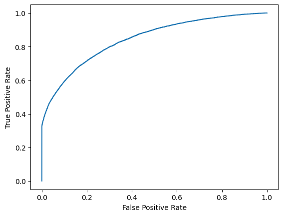

- Gradient Boosting
 - ROC AUC Score : 0.7450
 - Recall : 0.7450
 - Akurasi : 0.8009
 - Presisi : 0.6574
 - F1 Score : 0.4808

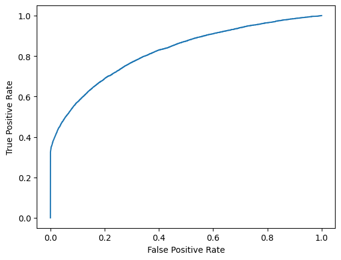

Dilihat dari hasil evaluasi, Performa Random Forest lebih baik dari Gradient Boosting dalam kasus ini. Sehingga disarankan menggunakan Model Random Forest.